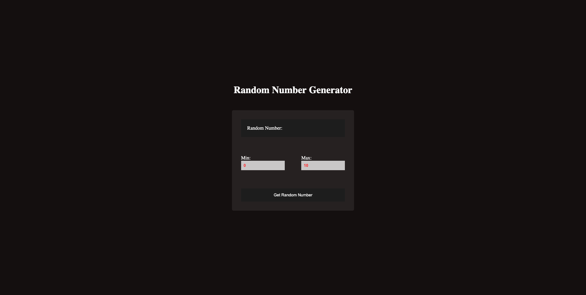

# React JS Random Number Selector
The following React application is a random number selector. It was built as a rep following a sample on CodeSandbox.io, working through it and reverse engineering it. It was originally requested by my partner who wanted a way to help with their decision making.
# 
## Getting Started:
The following is the link to the deployed [app]().

## Technologies Used:

## Credits
- (Random Number Generator App React) <a href="https://codesandbox.io/s/fcl5i?file=/src/App.js" title="Random Number Generator App React">original code by Shakhzod Tojiyev</a>